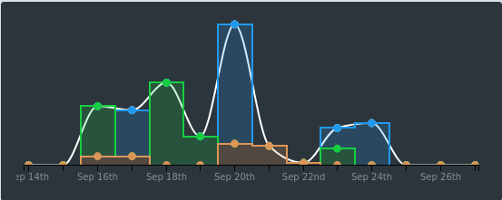
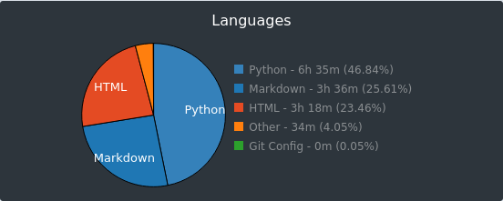

# 100 Days of Code - Days 1 to 15

This is the first retrospective of my [#100DaysOfCode](../challenges/100-days-of-code.html), compiling the impressions of the first 15 days into the challenge.

## Metrics

I coded for **14 hours and 4 minutes**, according to [WakaTime](https://wakatime.com/). However, it does not count the coding I did before installing WakaTime(that happened on Day 3) or the coding inside [CodeWars](https://www.codewars.com/)(started on Day 8).

Almost half of the time was expent with **Python** on projects, the rest of the time was with **HTML and Markdown** (both for this website maintenance).

## Rocked (or things that went really well):

1. **Access to high-quality material**: I followed [Henrique Bastos](https://henriquebastos.net/) courses awhile. I attended the **Welcome to the Django** talk at [FISL16](http://softwarelivre.org/fisl16) and got hooked by his expertise since then. Best course I ever purchased. The material is extremely hands-on and the theory is very easy to follow.
2. **Diversifying resources**: to further my practice in some language fundamentals like dictionaries and lists, I referred to [CodeWars](https://www.codewars.com/). There I could grab challenges in different difficult levels to train the same concepts I was struggling with. [HackerRank](https://www.hackerrank.com/) is also a good one.

## Flopped (or things that I should consider stop doing):

1.  **Code in the evenings**: it feels like completing a school assignment in the very last minute. Stressful. I do not like it. The code doesn't either; meaning it sucks more the later I start coding.
2.  **Not having a structure**: not knowing what I am supposed to study innevitably makes me waste a lot of time deciding WHAT to code in the first place. That leaves less time to figure out HOW to code.

## Project Ideas

Ideas that came to me while learning to code:
1. Subtitle linter for my [videos](https://www.youtube.com/user/LiviaNobregaLima), since YouTube's closed-captions have problems with my accent, apparently...

## In Conclusion
I learned a lot this 15 days and I expect the same in upcoming weeks. I'll write technical blog posts in the future, when not everything confuses me. For now, I'm documenting my journey from 1 to 100 days.

For more detail on how I did each day, check out my 100 Days of Code Log on [Github](https://github.com/livialima/100-days-of-code). Follow me on [Twitter](https://twitter.com/livialimatweets) for all my 100 Days Of Code tweets.
