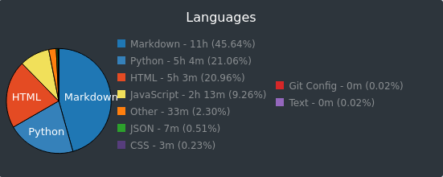

# 100 Days of Code - Days 16 to 30

This is the second retrospective of my [#100DaysOfCode](../challenges/100-days-of-code.html).

## Metrics

I coded for **24 hours and 4 minutes**, according to [WakaTime](https://wakatime.com/). That is a huge improvement! The first 15 days didn't get past 14 hours.

**Markdown** is still the top language as I'm using it much more for this website maintenance. However, this time around I was working on a different project and I had the opportunity to tap into different languages besides **Python**.

## Rocked (or things that went really well):

1. **Access to high-quality material**: Still a good one. This time I used [A Cloud Guru](https://acloudguru.com/) to get Python into the real world of cloud. Which leads us to the next item.
2. **Project**: to further my practice, I continued the [Cloud Resume Challenge](../challenges/cloud-resume.html) from where I stopped. When I first published my website I wanted it to be as simple as possible so, although heavily based, I avoided the coding part of the challenge. Now I had to study Lambda, DynamoDB, API Gateway. Still going with AWS SAM for the last touches of **Infrastructure as Code** and testing my Python functions.

## Flopped (or things that I should consider stop doing):

1.  **Distractions**: it seems all fine and dandy, but there was a 6-day gap between the days 19 and 20. Life got in the way pretty hard. I was about to quit when the **100DaysOfCode community** suggested I just hop back on the coding wagon and so I kept going.
2.  **Not having a structure**: I sorted this out by picking a project at a time. I'm not thinking too much ahead, just finishing one project and preparing for the next.

## In Conclusion
The [Cloud Resume Challenge](../challenges/cloud-resume.html) really got me excited to apply the Python I learned in the first 15 days, using AWS Lambda. It was a nice and short piece of code.

For more detail on how I did each day, check out my 100 Days of Code Log on [Github](https://github.com/livialima/100-days-of-code). Follow me on [Twitter](https://twitter.com/search?q=%23100DaysOfCode%20%40livialimatweets&src=typed_query&f=live) for all my 100 Days Of Code tweets.
