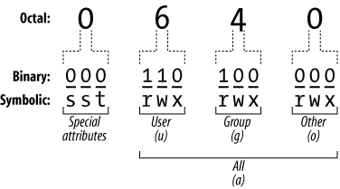

# Days 13 & 14 : Users, Groups and Permissions

This is part of the [#LinuxUpSkillChallenge](../challenges/linux-upskill.html). Don't forget to also check out the Official Instructions for days [13](https://github.com/snori74/linuxupskillchallenge/blob/master/13.md) and [14](https://github.com/snori74/linuxupskillchallenge/blob/master/14.md). Also check the [Reddit](https://www.reddit.com/r/linuxupskillchallenge/) posts.

 *video*

## 1. Groups

Options to check the available groups:

```cat /etc/group``` - see all users

```grep GID /etc/login.defs``` - to check the min/max GID for normal and system users

```getent group {1000..6000}``` - to retrieve only the normal groups

- Create a new group: ```sudo groupadd groupname```
- Delete an existing group: ```sudo groupdel groupname```
- Change the group name: ```sudo groupmod -n new_group_name old_group_name```
- Change file's group ownership: ```sudo chgrp groupname file/folder```

## 2. Users

Options to check the available users:

```cat /etc/passwd``` - see all usernames, names of users, home directories

```grep UID /etc/login.defs``` - to check the min/max UID for normal and system users

```getent passwd {1000..6000}``` - to retrieve only the normal users

```groups username``` - to see the list of groups the user is assigned to

- Create User: ```sudo adduser username```
- Create a new user belonging to the specified group: ```sudo adduser --ingroup group username```
- Change user password: ```sudo passwd username```
- Delete user: ```sudo userdel username```
- Change user's name: ```sudo usermod -l newname user```
- Change user's primary group: ```sudo usermod -g newgroup user```
- Add user to secondary groups: ```sudo usermod -aG group1,group2 user```
- Change file's user ownership: ```sudo chown -R username file/folder```

## 3. Sudo and sudoers

The sudoers file is a file used to allocate system rights to system users. This allows the administrator to control who does what. When you want to run a command that requires root rights, Linux checks your username against the sudoers file.

```
$ sudo usermod -aG sudo someuser
someuser is not in the sudoers file.  This incident will be reported.
```

To edit the sudoers file in a safe fashion, ```visudo``` is recommended. Visudo locks the sudoers file against multiple simultaneous edits, provides basic sanity checks, and checks for parse errors before installing the edited file.

```
## User privilege specification
root    ALL=(ALL:ALL) ALL
user    ALL=(ALL:ALL) ALL

# Members of the admin group may gain root privileges
%admin ALL=(ALL) ALL
%group ALL=(ALL) ALL

# Allow members of group sudo to execute any command
%sudo   ALL=(ALL:ALL) ALL
```

4. Permissions

Each file and directory has three user based permission groups:
 - **user** : apply only the owner of the file or directory, they will not impact the actions of other users.
 - **group** : apply only to the group that has been assigned to the file or directory, they will not affect the actions of other users.
 - **others** : apply to all other users on the system.

Each file or directory has three basic permission types:
 - **read** : capability to read the contents of the file.
 - **write** : capability to write or modify a file or directory.
 - **execute** : capability to execute a file or view the contents of a directory.


**Octal notation** is a numerical system for modifying permissions. Each octal permission can be represented by 3 or 4 numbers; where each of these numbers is an "octal", meaning they range from 0-7. They basically combine the following:
 - 7 = read(4) + write(2) + execute(1)
 - 6 = read(4) + write(2)
 - 5 = read(4) + execute(1)
 - 4 = read(4)
 - 3 = write(2) + execute(1)
 - 2 = write
 - 1 = execute



**umask** is used to control the default file permission for new files. It uses a four-digit octal number but can also be expressed using symbolic values.

```
$ umask
0002
$ umask -S
u=rwx,g=rwx,o=rx
$
```

**chmod**

- Change permissions of a file or folder (octal): ```sudo chmod 777 folder/file```
- Change permissions of a file or folder (symbolic): ```sudo chmod +x folder/file```

More about files and permissions, check out this [Eli the Computer Guy](
https://youtu.be/zRw0SKaXSfI) video.

For more detail on how I did each day, check out my log on [Reddit](https://www.reddit.com/user/livia2lima). Follow me on [Twitter](https://twitter.com/search?q=%23LinuxUpSkillChallenge%20%40livialimatweets&src=typed_query&f=live) for daily updates.
