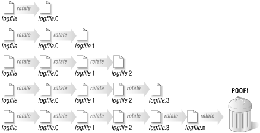

# Day 18 : Logs

This is part of the [#LinuxUpSkillChallenge](../challenges/linux-upskill.html). Don't forget to also check out the [Official Instructions](https://github.com/snori74/linuxupskillchallenge/blob/master/18.md) and the [Reddit](https://www.reddit.com/r/linuxupskillchallenge/) posts.

*video*

## 1. **What is log rotation?**

In information technology, log rotation is an automated process used in system administration in which log files are compressed, moved (archived), renamed or deleted once they are too old or too big (there can be other metrics that can apply here).

## 2. **How logs rotate?**

Typically, a new logfile is created periodically, and the old logfile is renamed by appending a number to the name. Each time a new log file is started, the numbers in the file names of old logfiles are increased by one, so the files "rotate" through the numbers (thus the name "log rotation"). Old logfiles whose number exceeds a threshold can then be deleted or archived off-line to save space.




## 3. **Log Rotate**

To edit the configuration for log rotation: ```sudo vim /etc/logrotate.conf```

Frequency can be hourly, daily, weekly, monthly or yearly:

```
# rotate log files weekly
weekly
```

Log files are rotated **count** times before being removed. If count is 0, old versions are removed rather than rotated.

```
# keep 4 weeks worth of backlogs
rotate 4
```

Old versions of log files are compressed with ```gzip``` by default:

```
# comment this if you want your log files uncompressed
compress
```

## 4. **Journaling**

The process of collecting and managing logs is known as **journaling**.

Linux uses ```journalctl``` as the utility to query all that journal information:

  - Show all messages from this boot: ```journalctl -b```
  - Show all messages from last boot: ```journalctl -b -1```
  - Show all messages with priority level 3 (errors) from this boot:
    ```journalctl -b --priority=3```
  - Follow new messages (like `tail -f` for traditional syslog): ```journalctl -f```
  - Show all messages by a specific unit: ```journalctl -u unit```
  - Filter messages within a time range (either timestamp or placeholders like "yesterday"):
    ```journalctl --since now|today|yesterday|tomorrow --until YYYY-MM-DD HH:MM:SS```
  - Show all messages by a specific executable:
    ```journalctl path/to/executable```

For more detail on how I did each day, check out my log on [Reddit](https://www.reddit.com/user/livia2lima). Follow me on [Twitter](https://twitter.com/search?q=%23LinuxUpSkillChallenge%20%40livialimatweets&src=typed_query&f=live) for daily updates.
