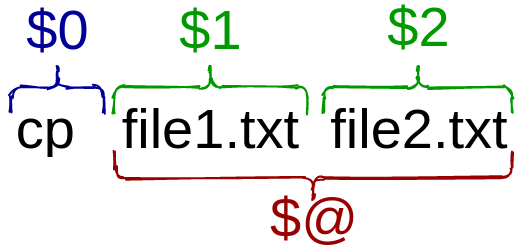

# Day 20 : Scripting

This is part of the [#LinuxUpSkillChallenge](../challenges/linux-upskill.html). Don't forget to also check out the [Official Instructions](https://github.com/snori74/linuxupskillchallenge/blob/master/20.md) and the [Reddit](https://www.reddit.com/r/linuxupskillchallenge/) posts.

*video*

## 1. What is a shell script?

A shell script is a computer program designed to be run by a command-line interpreter (aka shell).

Typical operations performed by shell scripts include file manipulation, program execution, and printing text.

Any combination of commands and syntax recognizable by the shell can be considered a script. It can be done directly in the command-line:

```
$ File="my_file.txt" ; if [ -e $File ] ; then echo "The file $File exists." ; else echo "The file $File does not exist." ; fi
The file my_file.txt does not exist.
$
```

But the true power of shell scripting can be achieved by automating it into a file.

## 2. Start with a bang!

There are various shells and each has its own dialect. A few examples are **Bourne-Again Shell** (bash), **Z Shell** (zsh), **C Shell** (csh) and **KornShell** (ksh). How do I know which one was a script wrote for?

That's why the first line of script starts with ```#!```, the she-bang (or hash-bang) followed by the path to the executable program that will interpret the script.

```
#!/bin/bash
```

This is a special kind of comment that determine what interpreter (aka shell) to use to execute the file.

**DISCLAIMER: this tutorial is focused on bash shell.**

## 3. Executing a script

Comments are lines of code meant for humans to understand, to make the source code easier to read. They usually begin with the hash symbol ```#``` and, except for the she-bang, are ignored by the shell during execution.

```
# This line will not be executed
echo "This line will"	# but not this part
```

To make a file executable, you must set the file permissions to enable execution:

```
$ chmod +x my-script.sh
```

And to execute, you must call the relative path ```./``` followed by the file name:

```
$ ./my-script.sh
```

**NOTE:** the extension ```.sh``` is not obligatory, any file that is executable and has the fist line start with a she-bang is, in fact, a shell script.

## 4. Variables

Variable is a symbolic name for a chunk of memory to which we can assign values, read and manipulate its contents. It's a really handy resource, specially when you have to reference the same thing several times.

```
AUTH_LOG="/var/log/auth.log"
echo "Reading $AUTH_LOG ..."
```

Environment variables are also used in scripts:

```
echo "You are $USER and you are at $PWD"
```

## 5. Input

**Positional parameters**

A positional parameter is a variable within a shell program; its value is set from an argument specified on the command line that invokes the program.



- **$0** - filename of the current script
- **$n** - $1, $2, $3...
- **$#** - total number of arguments provided
- **$@** - print all the parameters starting at $1
- **$?** - exist status of the last command

## 6. Conditionals and Loops

Conditionals allow us to make decisions, to decide whether or not to run a piece of code based upon conditions that we may set.

For that we use the statements **If / Elif / Else / Fi**:

```
if [test]
  then
    # do something if test is true
  elif [other test]
    then
      # do something else if other test is true
    else
      # do a 3rd thing if all tests returned false
fi
```

Anything between **then** and **fi** (if backwards) will be executed only if the test (between the square brackets) is true.

```
if [ -z "$1" ]; then
		echo -e "\nUsage: `$0` <num>"
		exit 0
fi
```

Some common tests:

- **-n str** : the length of ```str``` is greater than zero
- **-z str** : the lengh of ```str``` is zero (ie it is empty)
- **-e file** : ```file``` exists
- **-d file** : ```file``` exists and is a directory
- **-s file** : ```file``` exists and it is not empty

There are sooooo much more to shell scripting than this. We barely touched the surface. To learn more, check out [Shell Scripting Tutorial by Ryan Chadwick](https://ryanstutorials.net/bash-scripting-tutorial/), [Shell Scripting Tutorial by Steve Parker](https://www.shellscript.sh/) and [shellhaters.org](http://shellhaters.org/) to learn more.

For more detail on how I did each day, check out my log on [Reddit](https://www.reddit.com/user/livia2lima). Follow me on [Twitter](https://twitter.com/search?q=%23LinuxUpSkillChallenge%20%40livialimatweets&src=typed_query&f=live) for daily updates.
