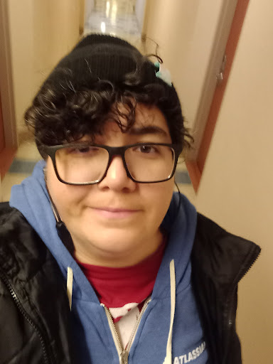

---
hide:
  - navigation
  - toc
---
# About Me

My name is Livia Nóbrega Lima, I am originally from Brazil and a huge nerd. I love technology and getting my hands into the CLI to try something new. Let me learn and I will never be bored.

My main expertise is network support and administration. I've been working with this in various forms for over 10 years. I executed projects, troubleshooted issues, trained staff and was in charge of governance. I also worked with storage solutions and application support.

In my spare time, I've been publishing technical tutorials on my [YouTube](https://www.youtube.com/@livia2lima) channel, and being responsible for the [Linux Upskill Challenge](https://linuxupskillchallenge.org).

Outside of technology, I enjoy [music](https://open.spotify.com/user/12163736583 "the music I listen to"), [craft beer](https://untappd.com/user/livialima "the beers I drink"), [comic books](https://www.goodreads.com/user/show/113604841-livia-lima "the books I read") and rugby. I've done [crossfit](https://games.crossfit.com/athlete/1689757 "Shame on me, I haven't been in a box in years!") in the past but today I keep my stress levels down by doing some light exercise and drinking tea.

# Awesome stuff I did

I'm a member of the [Linux Professional Institute](https://people.lpi.org/m/LPI000190681), LPIC-1, LFCA and specialized in other infrastructure technologies like Storage and Network. I've got a few shiny badges on [Credly](https://www.credly.com/users/livia-lima/badges?sort=-state_updated_at&page=1) to prove it. 

Here's a short list of things I've done while working (or off-hours) that I'm proud of:

**Created the Linux Upskill Challenge video-series** as a support material for the [month-long course](https://linuxupskillchallenge.org). As a result, I also became the [official mantainer](https://github.com/livialima/linuxupskillchallenge) for the project.

**Created a static website on AWS from scratch** (yes, this one you are seeing right now) as a personal project. A lot has changed since then, I'm no longer on AWS but I can get myself around with static content hosting now.

**Saved 50k USD to client (a major US bank)** by applying proper governance to their inventory of network circuits and telephone lines.

**Increased to 35% the rate of Cisco certified analysts** in the technical staff of a network operations centre. Entry level candidates that get in today are still trained in the framework I developed.

**Transitioned the scope of Voice support** to integrate to my former Network team. I worked closely with stakeholders to deploy the process and structured training. I was able to complete the transition in under 1 year, with 200+ technical articles in place and 8+ network analysts fully trained.

# Awesome stuff I post

My other interests can be found throughout my [social media accounts](https://bio.link/livialima), each to some degree.

*   [YouTube](https://www.youtube.com/@livia2lima)
*   [Mastodon](https://fosstodon.org/@livialima)
*   [LinkedIn](https://www.linkedin.com/in/livialima/)
*   [Instagram](https://www.instagram.com/livia2lima/)
*   [Twitch](https://twitch.tv/livialimastreams)

# Awesome support from you

If you appreciate my work, you can [buy me a coffee](https://www.buymeacoffee.com/livialima "Thanks!") or become my [sponsor](https://github.com/sponsors/livialima/ "sponsor me on GitHub") if you feel extra generous.

---------------------------

**DISCLAIMER : The opinions expressed on this page are my own views and not those of any of my employers, past or present. This page is run as an independent blog.**
