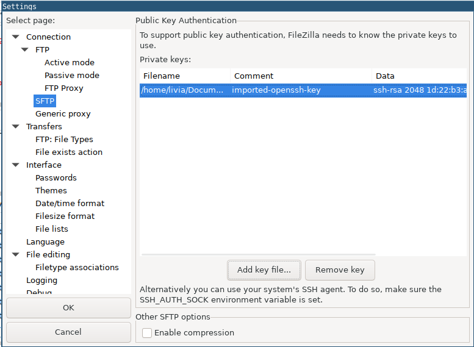

# FileZilla Basics

**[FileZilla](https://filezilla-project.org/)** is a free and open-source FTP client.

## Basic Connection
Using Quickconnect bar:
- Enter the remote *hostname* or *IP address* at **Host**.
- Enter the remote *username* at **Username** and the *password* at **Password**.
- **Port**: 21 for FTP, 22 for SFTP
- Click **Quickconnect**. Example:

Using Site Manager:
- On the **File** menu, click **Site Manager**.
- In the Protocol list box, select **FTP**.
- In the **Host** text box, type the *hostname* or *IP address*.
- In the **Port** text box, type **21**.
- In the **Logon Type** list box, select **Normal**.
- In the **User** text box, type your *username*.
- In the **Password** text box type your *password*.
- Click **Connect**.

## Add a private key for SSH authentication
- On the **Edit** menu, click **Settings**.
- Under Select Page, click **Connection**, and then click **SFTP**. A list of currently installed private keys appears.
- Click **Add key file**. Select the key, and then click **Open**.

- On the **File** menu, click **Site Manager**.
- In the Protocol list box, select **SFTP**.
- In the **Host** text box, type the *hostname* or *IP address*.
- In the **Port** text box, type **22**.
- In the **Logon Type** list box, select **Normal**.
- In the **User** text box, type your *username*.
- Leave the **Password** text box blank.
- Click **Connect**.

After a few seconds, FileZilla establishes a connection to the server.
FileZilla may display a message that the server's host key is unknown. To trust the server permanently, select the Always trust this host, add this key to the cache check box, and then click OK.

## Tranfering files
Once a remote connection is open, you can navigate on the server almost like navigating on your local machine. The current local directory tree is displayed on the left side of the main window by default, the remote directory is displayed on the right side.

To transfer directories and/or multiple files:
- Select the files.
- Right-click the selection.
- Then you can click on Upload/Download in the popup menu.

Or drag the files from one side and drop them on the other side.

More about FileZilla can be found at the [manual page](https://wiki.filezilla-project.org/Documentation).
