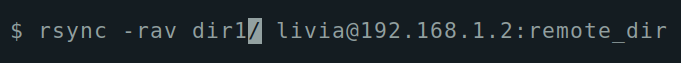

# RSync Basic Commands

**[rsync](https://rsync.samba.org/)** (remote sync) is an open source utility used for synchronizing files and directories between two different systems, providing fast incremental file transfer. It is a great tool to perform backups.

## Basic usage

To sync the contents of source directory(dir1) to a destination directory(dir2) on the same system:

```rsync -a dir1/ dir2 ```

To sync the contents of a local directory(dir1) to a remote directory(dir2):

```rsync -a dir1/ username@remote_host:dir2```

To sync the contents of a local directory(dir1) to a remote directory(dir2), when using a SSH identity file (private key) for public key authentication:

```rsync -e "ssh -i keypair.pem" -a dir1/ username@remote_host:dir2```

## Verbose (--verbose, -v)

By default, rsync works silently. This option allows you to see what's happening during the transfer, even if no files are transfered.

```rsync -v dir1/ dir2 ```

```
$ rsync -v dir1/ livia@192.168.1.2:remote_dir
livia@192.168.1.2's password:
skipping directory .

sent 16 bytes  received 12 bytes  6.22 bytes/sec
total size is 0  speedup is 0.00
$
```

## Archive (--archive, -a)

It is a quick way of saying you want to preserve almost everything.

```rsync -a dir1/ dir2 ```

```
$ rsync -av dir1/ livia@192.168.1.2:remote_dir
sending incremental file list
./
file1
file2
file3

sent 2,183 bytes  received 589 bytes  792.00 bytes/sec
total size is 498  speedup is 0.18
$
```

## Recursive (--recursive, -r)

This tells rsync to copy directories recursively.

```rsync -r dir1/ dir2 ```

```
$ rsync -rav dir1/ livia@192.168.1.2:remote_dir
sending incremental file list
subdir1/
subdir1/subfile1
subdir1/subfile2
subdir1/subfile3

sent 391 bytes  received 77 bytes  133.71 bytes/sec
total size is 83  speedup is 0.18
$
```

**DISCLAIMER:** Noticed that there is a trailing slash (/) at the end of the first argument in ```dir1/```



This is necessary to mean “the contents of dir1”. The alternative, without the trailing slash, would place ```dir1```, including the directory, within ```dir2```. This would create a hierarchy that looks like:

```~/dir2/dir1/[files]```

Compare this output with the trailing slash:

```
$ rsync -rav dir1/ livia@192.168.1.2:remote_dir
sending incremental file list
./
file1
file2
file3
subdir1/
subdir1/subfile1
subdir1/subfile2
subdir1/subfile3

sent 534 bytes  received 145 bytes  194.00 bytes/sec
total size is 83  speedup is 0.12
$ tree remote_dir/
remote_dir/
├── file1
├── file2
├── file3
└── subdir1
    ├── subfile1
    ├── subfile2
    └── subfile3

1 directory, 6 files
livia@antix1:~
$
```

And when we remove the trailing slash:

```
$ rsync -rav dir1 livia@192.168.1.2:remote_dir
sending incremental file list
dir1/
dir1/file1
dir1/file2
dir1/file3
dir1/subdir1/
dir1/subdir1/subfile1
dir1/subdir1/subfile2
dir1/subdir1/subfile3

sent 850 bytes  received 260 bytes  246.67 bytes/sec
total size is 83  speedup is 0.07
$ tree remote_dir/
remote_dir/
└── dir1
    ├── file1
    ├── file2
    ├── file3
    └── subdir1
        ├── subfile1
        ├── subfile2
        └── subfile3

2 directories, 6 files
livia@antix1:~
$
```

You can see here that the directory itself is transferred.

## Update (--update, -u)

This forces rsync to skip any files which exist on the destination and have a modified time that is newer than the source file.

```rsync -u dir1/ dir2 ```

Notice how the size and modified date changes from ```83 Nov 26 16:56 file1``` to ```677 Nov 27 14:10 file1```.

```
$ ls -lh remote_dir/
total 8.0K
-rw-rw-r-- 1 livia livia   83 Nov 26 16:56 file1
-rw-rw-r-- 1 livia livia    0 Nov 26 15:58 file2
-rw-rw-r-- 1 livia livia    0 Nov 26 15:58 file3
drwxrwxr-x 2 livia livia 4.0K Nov 27 13:42 subdir1

$ rsync -rauv dir1/ livia@192.168.1.2:remote_dir
livia@192.168.1.2's password:
sending incremental file list
./
file1

sent 934 bytes  received 45 bytes  217.56 bytes/sec
total size is 677  speedup is 0.69

$ ls -lh remote_dir/
total 8.0K
-rw-rw-r-- 1 livia livia  677 Nov 27 14:10 file1
-rw-rw-r-- 1 livia livia    0 Nov 26 15:58 file2
-rw-rw-r-- 1 livia livia    0 Nov 26 15:58 file3
drwxrwxr-x 2 livia livia 4.0K Nov 27 13:42 subdir1
$
```

## Dry Run (--dry-run, -n)

This makes rsync perform a trial run that doesn't make any changes (and produces mostly the same output as a real run). Good resource to test the parameters before doing a big transfer.

```rsync -n dir1/ dir2 ```

```
$ rsync -rauvn dir1/ livia@192.168.1.2:remote_dir
sending incremental file list
./
file1
file2
file3
subdir1/
subdir1/subfile1
subdir1/subfile2
subdir1/subfile3

sent 235 bytes  received 41 bytes  78.86 bytes/sec
total size is 677  speedup is 2.45 (DRY RUN)

$ tree remote_dir/
remote_dir/

0 directories, 0 files
livia@antix1:~
$
```

## Progress (--progress, -P)

This option tells rsync to print information showing the progress of the transfer.

```rsync -P dir1/ dir2 ```

```
$ rsync -rauvP dir1/ livia@192.168.1.2:remote_dir
sending incremental file list
./
big-file
     67,562,098 100%    1.16MB/s    0:00:55 (xfr#1, to-chk=7/9)

sent 67,562,098 bytes  received 100 bytes  945,162.08 bytes/sec
total size is 67,562,198  speedup is 1.00
$
```

More about rsync can be found at the [manual page](https://download.samba.org/pub/rsync/rsync.1).
