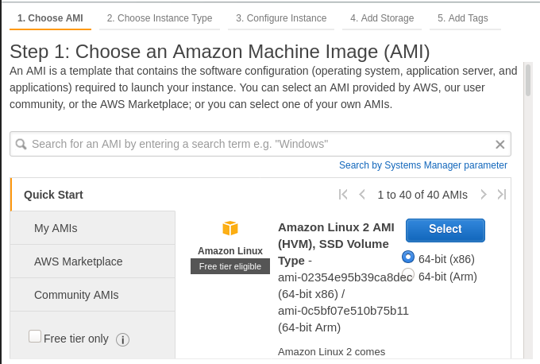
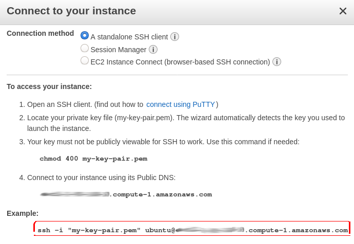
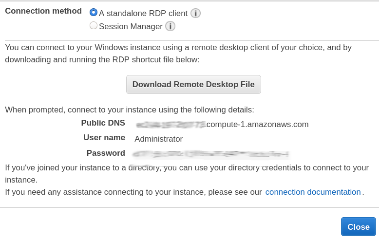

# How to launch an EC2 instance

The intent is to show how to quickly launch your first EC2 instance.

## Step 1 : Choose the type of instance
- Navigate to EC2 in the AWS Console.
- Click **Launch Instance**.
- Select a free-tier elegible Linux image, in doubt select **Amazon Linux 2**.
- Click **Next** - leave the **Instance Type** panel as is.
- Click **Next** - leave the **Instance Details** panel as is.
- Click **Next** - leave the **Storage** panel as is.
- Click **Add Tag**. Set key to **Name** and value to the name you choose to your instance. (Optional step)
- Click **Next**.


## Step 2 : Create a Security Group
- Assign a security group: Create a new security group
- Set the security group name and description as you choose.
- SSH connection for Linux instances
 - Type: **SSH**
 - Protocol: **TCP**
 - Port Range: **22**
 - Source: **My IP**
 - Description: (optional)
- RDP connection for Windows instances
 - Type: **RDP**
 - Protocol: **TCP**
 - Port Range: **8003**
 - Source: **My IP**
 - Description: (optional)
- You can add as much rules as needed.
- Click Review and Launch.
- Click Launch.


## Step 3 : Create a Key Pair
- Select: **Create a new key pair**
- Set the key pair name as you choose.
- Click **Download Key Pair**
- Click **Launch Instances**


## Step 4 (for Linux instances) : Connect to instance using SSH
- Back to EC2 Instances panel in the AWS Console.
- Select the instance.
- Click **Connect**.
- Connection method: **A standalone SSH client**

For MacOS and Linux users:
- Change the keypair file permissions to Only Owner Read/Write as follows:
```
chmod 400 my-key-pair.pem
```

Or, if you are using Windows:
- File - Properties - Security - Advanced
- Set Owner to the key's user
- Remove all users, groups, and services, except for the key's user, under Permission Entries
- Set key's user to Full Control

At the SSH client of your choice, input the details provided.
- User name
- Target
```
ssh -i my-key-pair.pem user@server-public-dns
```
Example:
```
ssh -i "linux-lab.pem" ubuntu@ec2-52-90-153-75.compute-1.amazonaws.com
```


## Step 4 (for Windows instances) : Connect to instance using RDP
- Back to EC2 Instances panel in the AWS Console.
- Select the instance.
- Click **Connect**.
- Connection method: **A standalone RDP client**
- At the RDP client of your choice, input the details provided.
- Target: **Public DNS**
- User name **Administrator**
- Password:
  - Click **Get Password**
  - Key Pair Path: Click **Browse** to select the keypair downloaded on the previous step.
  - Click **Decrypt Password**
- **Connect**.

