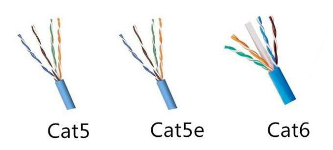
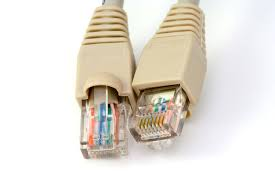
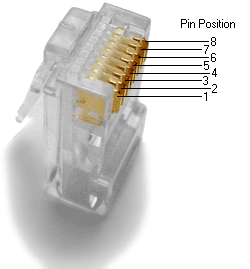
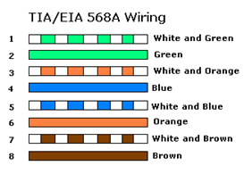
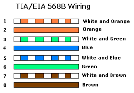
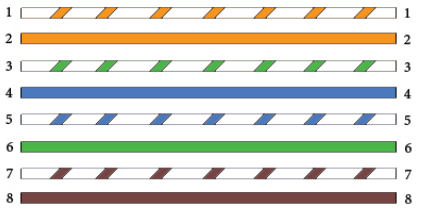
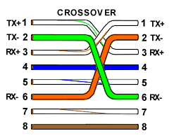

# How to make a network cable

The aim of this tutorial is to give an overview of cable networking theory and to show how to crimp a connector onto the end of a network cable.

DISCLAIMER: This tutorial focus only on copper-wired, twisted pair cables.

## Requirements

The tools needed to make a network cable are:
- An [ethernet cable](https://www.amazon.com/Mediabridge-Ethernet-Cable-Feet-31-399-25X/dp/B001W28L2Y/ref=sr_1_3?dchild=1&keywords=ethernet+cable+cat5&qid=1602205353&sr=8-3) (Cat5/Cat6).
- A few [RJ45 connectors](https://www.amazon.com/CableCreation-100-PACK-Connector-Connectors-Transparent/dp/B01K9Z4FT2/ref=sr_1_3?dchild=1&keywords=RJ45+connectors&qid=1602205406&sr=8-3). Please buy more than 2 units. These things are cheap and it is easy for a newbie to break them.
- A [mini wire stripper](https://www.amazon.com/Stripper-Crimping-Stripping-Telephone-BUSHIBU/dp/B0768QBNWQ/ref=sr_1_2?dchild=1&keywords=mini+wire+stripper&qid=1602205429&sr=8-2) or a knife (but be careful). You can also use a pair of scissors.
- A [crimper](https://www.amazon.com/dp/B087YSF629?pd_rd_i=B087YSF629&pd_rd_w=NsJnk&pf_rd_p=4f746af9-b6d9-45af-93e9-2f6052926c10&pd_rd_wg=Onefk&pf_rd_r=7A7EKZ0D06JP9GVTPW3R&pd_rd_r=f84f5db8-6543-4bfc-8b3b-6e2a436152e4). Make sure it does crimp RJ45 connectors (has the capacity for eight wires).
- A [cable tester](https://www.amazon.com/iMBAPrice-Network-Cable-Tester-Phone/dp/B01M63EMBQ/ref=sr_1_3?dchild=1&keywords=network+cable+tester&qid=1602205519&sr=8-3). Optional but very useful during troubleshooting.

## Cables

Ethernet cables consist of 8 copper wires, twisted in 4 pairs. The purpose of the twisting is to reduce electromagnetic radiation from the pair and crosstalk between neighboring pairs. This also improves rejection of external electromagnetic interference.

Twisted pair cables can be **unshielded** (UTP) or **shielded** (STP) with an additional layer of conductive material to attenuate electromagnetic waves external to the shield.

Some examples:
- **Cat5**: Unshielded. 100BASE-TX / 1000BASE-T. Limited to 100m between equipment. Common for current LANs.
- **Cat5e**: Shielded. 1000BASE-T / 2.5GBASE-T. Limited to 100m between equipment. Enhanced Cat5. Common for current LANs. Same construction as Cat5, but with better testing standards.
- **Cat6**: Shielded. 5GBASE-T / 10GBASE-T. Limited to 55M distance at 10GBASE-T

The contents of the cable are exactly the same no matter what the plastic jacket color is.

## Connectors

The conventional name for the connectors on the ends of Ethernet cables is **RJ-45**. They consist of 8 pins, one for each wire inside an Ethernet cable.

## Colors and Pins

There is a sequence for the pins in an RJ-45 connector:

The important factor to remember when wiring RJ-45 plugs is the function of each pin.:
1. Transmit positive signal (Tx+)
2. Transmit negative signal (Tx-)
3. Receive positive signal (Rx+)
4. Nothing
5. Nothing
6. Receive negative signal (Rx-)
7. Nothing
8. Nothing

Following that sequence, there are two main standard pinouts (or orders) for the colored wires of the cable.

RJ-45 TIA-568A pinout:
1. Green stripe
2. Green solid
3. Orange stripe
4. Blue solid
5. Blue stripe
6. Orange solid
7. Brown stripe
8. Brown solid

RJ-45 TIA-568B pinout:
1. Orange stripe
2. Orange solid
3. Green stripe
4. Blue solid
5. Blue stripe
6. Green solid
7. Brown stripe
8. Brown solid

It doesn’t matter which of these standards you use just as long as you are consistent when crimping connectors onto both ends of a cable.

## Straight, crossover or rollover?

The distinction between a straight through, crossover, and rollover cable comes down to the way that the connectors on each end are wired.

- **Straight through**: both sides follow the same wire positions. Straight-Through wired cables are most commonly used to connect a host to a client.

- **Crossover**: Tx and Rx pairs switch positions (pins 1 & 2 switch to pins 3 & 6). Crossover cables are most commonly used to connect two hosts directly. Examples would be connecting a computer directly to another computer, connecting a switch directly to another switch, or connecting a router to a router.

- **Rollover**: all pin positions are reversed (pin 1 goes to pin 8, pin 2 to pin 7, etc). Rollover cables are most commonly used to connect to a device's console port to make programming changes to the device. Unlike crossover and straight-wired cables, rollover cables are not intended to carry data but instead create an interface with the device.

## Making your cable
Check out my [video about crossover cables](https://www.youtube.com/embed/hhELDJHRz_0) for some visuals.

1. Using a cable stripper, a knife or a pair of scissors, cut the outter plastic jacket of the Ethernet cable. **CAUTION: be gentle! If you go too deep you will cut through the inner wires, exposing the copper.**
2. Untwist the pairs and straight them to make them easier to manipulate.
3. Arrange them in the desired standard.
4. Measure the wires to the be enough to fit into the RJ-45 connector.
5. Cut off the excess wire. Ensure to level the wires, they should align to the flat edge of the connector.
6. Carefully, slide the wires inside the connector. Push them enough to see the copper at the edge of the connector.
7. Crimp it. The pins should pierce throught the wires.
8. Repeat the process on the other end of the cable.
9. Test the cable using a cable tester. Plug each connector into the tester and turn it on. All pins should send and receive signal. If any pins do not light up on the tester, the connector was badly crimped. Cut the damaged connector and start over.

## Conclusion

In this tutorial, you learned the basics of cable networking theory and how to crimp your own network cable.
